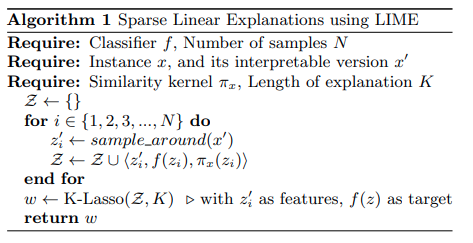

# LIME-XAI
LIME is a technique used to explain the predictions of any machine learning model by approximating it locally with an interpretable model. this is a from scratch implementation applied to explain the predictions of an LSTM text classifier.

The algorithm is the following as mentioned in the paper ["Why Should I Trust You?": Explaining the Predictions of Any Classifier
Marco Tulio Ribeiro, Sameer Singh, Carlos Guestrin](https://arxiv.org/abs/1602.04938)

